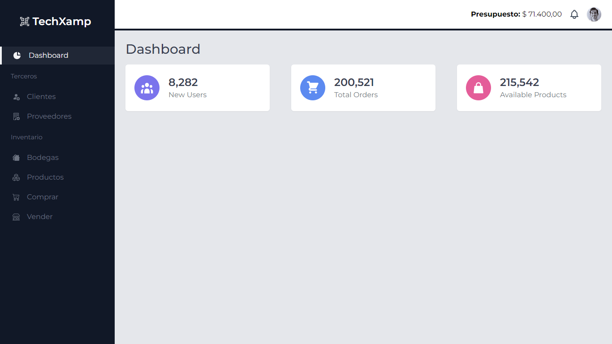

Sistema de Gestión de Inventario - API en Laravel

Este proyecto es un sistema de gestión de inventario desarrollado en Laravel. Proporciona una API RESTful que permite realizar operaciones CRUD sobre los elementos del inventario, facilitando su gestión y control.

Requisitos
PHP 8.1 o superior
Composer
MySQL o cualquier otro sistema de base de datos compatible

Instalación
Clonar el repositorio:

git clone https://github.com/JuanRios-dev/TechXamp-ApiLaravel.git
cd TechXamp-ApiLaravel

Actualizar las dependencias de Composer:
composer update

Crear una clave de aplicación:
php artisan key:generate

Configurar la base de datos:
Copia el archivo .env.example a .env:

Abre el archivo .env y configura los detalles de tu base de datos:

DB_DATABASE=nombre_de_tu_base_de_datos
DB_USERNAME=tu_usuario
DB_PASSWORD=tu_contraseña

Ejecutar las migraciones y el seeder:
php artisan migrate db:seed

Acceso
Puedes iniciar sesión con las siguientes credenciales de prueba:

Usuario: test@example.com
Contraseña: 12345678

Contribuciones
Las contribuciones son bienvenidas. Si deseas contribuir, por favor abre un "issue" o envía un "pull request".